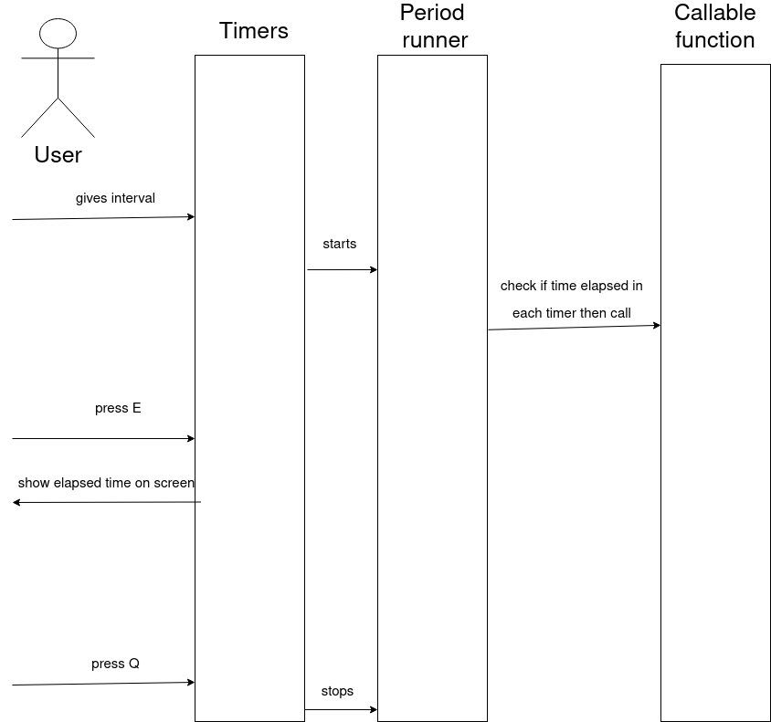

# Timer



# brief overview of design

Program starts by getting from user interval by command line.  
Each timer is based on simple check every 900ns if time(interval) between last calling function elapsed.  
If time(interval) elapses function is called.
Check is done in loop. But if function is marked to be called once, it won't be called more than once.
Check is repeated until user type Q on keyboard and press Enter.
If user type "E" all timers elapsed time(time since start counting) is displayed.


# how to run

install:
```
sudo apt-get install libgtest-dev libgmock-dev
```

```
mkdir build  
cd build && cmake .. && make  
./main  
```